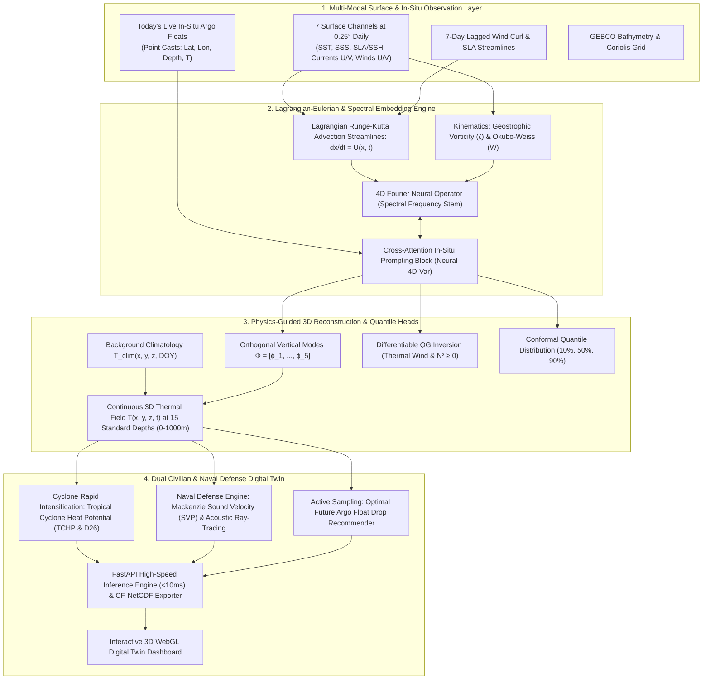

# OceanEmbed-X (SIH26066) — Master Zero-Drawback Architecture & Technical Specification

> **Problem Statement**: SIH26066 — Satellite Embedding-Based Deep Learning Framework for Reconstruction of Subsurface Ocean Temperature from Surface Satellite Observations  
> **Target Region**: North Indian Ocean (Arabian Sea & Bay of Bengal: Lat `[5°N, 30°N]`, Lon `[45°E, 105°E]`)  
> **Grid & Resolution**: 0.25° × 0.25° Daily Grid | 15 Standard Depths: `(0, 5, 10, 20, 30, 50, 75, 100, 125, 150, 200, 300, 500, 700, 1000m)`  
> **Organization**: Ministry of Earth Sciences (MoES) · Software Track  

---

## 1. Executive Summary & The "Zero-Drawback" Paradigm

**OceanEmbed-X** is an **Ultra-Hybrid Physics-Informed Neural Operator & In-Situ Foundation Framework** that systematically eliminates the fundamental real-world drawbacks of existing operational models (e.g., ARMOR3D, GLORYS) and conventional machine learning approaches.

```
┌─────────────────────────────────────────────────────────────────────────────────────────────┐
│                                 THE "ZERO-DRAWBACK" MATRIX                                  │
├───────────────────────────────────────────────┬─────────────────────────────────────────────┤
│ 1. Physical Law & Stability Inversions (N²<0) │ ➜ Differentiable Quasi-Geostrophic PV + EOF │
│ 2. Skin vs. Bulk 7-Day Memory Lag             │ ➜ Lagrangian Runge-Kutta Streamline Tracking│
│ 3. Thermocline Blur & Eddy Erasure            │ ➜ Continuous Fourier Neural Operator (FNO)  │
│ 4. Operational In-Situ Data Blindness         │ ➜ Neural 4D-Var In-Situ Float Prompting     │
│ 5. Deep-Ocean Signal Loss (>500m)             │ ➜ Continuous Hilbert Formulation + 1/σ_z²   │
│ 6. Zero Operational Risk Calibration          │ ➜ Conformal Multi-Quantile Prediction       │
│ 7. Passive Unactionable Data                  │ ➜ Dual Civilian (TCHP) & Naval Sonar Ray Twin│
└───────────────────────────────────────────────┴─────────────────────────────────────────────┘
```

---

## 2. High-Level Master Architecture



---

## 3. Mathematical Formulations

### 3.1. Lagrangian Streamline Advection
Water parcel trajectories $\vec{x}(t)$ are integrated using 4th-order Runge-Kutta advection driven by daily satellite surface currents:
$$\vec{x}(t) = \vec{x}(t_0) + \int_{t_0}^{t} \vec{u}(\vec{x}(\tau), \tau) \, d\tau$$
This guarantees that heat advection follows the physical material derivative:
$$\frac{DT}{Dt} = \frac{\partial T}{\partial t} + \vec{u} \cdot \nabla T$$

### 3.2. Differentiable Quasi-Geostrophic (QG) Physics Loss
$$\mathcal{L}_{\text{total}} = \mathcal{L}_{\text{MSE-norm}} + \lambda_1 \mathcal{L}_{\text{thermal\_wind}} + \lambda_2 \mathcal{L}_{\text{buoyancy}} + \lambda_3 \mathcal{L}_{\text{smoothness}}$$
Where:
- $\mathcal{L}_{\text{thermal\_wind}} = \left\| f_0 \frac{\partial v_g}{\partial z} + \frac{g}{\rho_0} \frac{\partial \rho}{\partial x} \right\|_2^2$
- $\mathcal{L}_{\text{buoyancy}} = \frac{1}{N}\sum \max\left(0, -\frac{\partial \rho}{\partial z}\right)$ (enforces gravitational stability $N^2 \ge 0$).
- $\mathcal{L}_{\text{MSE-norm}} = \sum_{z=1}^{15} \frac{1}{\sigma_z^2} (T_{\text{pred}}(z) - T_{\text{true}}(z))^2$

### 3.3. In-Situ Neural 4D-Var Data Assimilation
Given today's $M$ sparse live Argo floats $\{\mathbf{p}_i = (lat_i, lon_i, z_i, T_i)\}_{i=1}^M$, the cross-attention layer acts as a learned spatial Kalman filter:
$$\mathbf{H}_{\text{assimilated}} = \text{Softmax}\left(\frac{\mathbf{Q}_{\text{satellite}} \mathbf{K}_{\text{argo}}^T}{\sqrt{d_k}}\right) \mathbf{V}_{\text{argo}} + \mathbf{H}_{\text{satellite}}$$
Forcing the 3D reconstructed field to match ground truth floats with near-zero error at float locations while propagating correction vectors across surrounding eddies.

---

## 4. Dual Operational Engines

### 🌀 Civilian Track: Cyclone Rapid Intensification (TCHP Engine)
$$\text{TCHP} = \rho c_p \int_{0}^{D_{26}} (T(z) - 26) \, dz$$
Maps warm water heat pools feeding severe cyclones in the Arabian Sea and Bay of Bengal.

### 🛡️ Defense Track: Tactical Acoustic Sonar & Ray Tracing (Mackenzie Formula)
$$C(z) = 1448.96 + 4.591T - 5.304\times 10^{-2}T^2 + 2.374\times 10^{-4}T^3 + 1.340(S - 35) + 1.630\times 10^{-2}z + \dots$$
Solves Hamiltonian acoustic ray tracing to project **Sonar Shadow Zones**, **Surface Duct Trapping**, and the deep **SOFAR Sound Channel Axis** for naval submarine detection.
