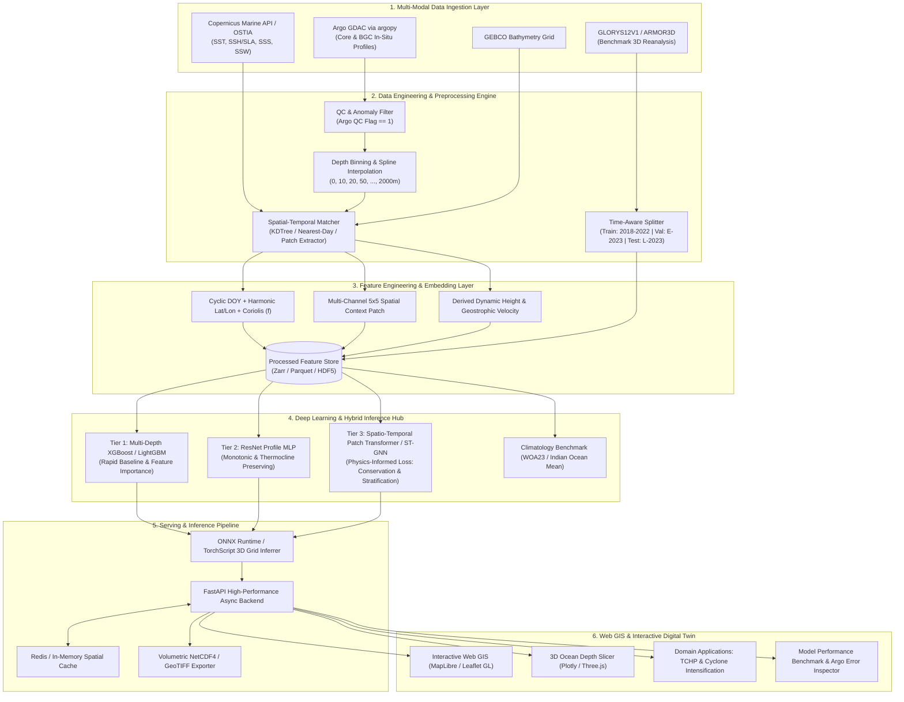
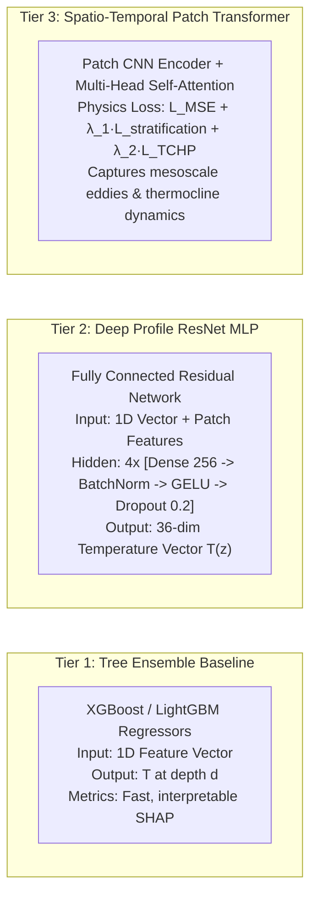

# OceanEmbed (SIH26066) — End-to-End System Architecture & Technical Specification

> **Problem Statement**: SIH26066 — Satellite Embedding-Based Deep Learning Framework for Reconstruction of Subsurface Ocean Temperature from Surface Satellite Observations  
> **Target Region**: North Indian Ocean (Arabian Sea & Bay of Bengal: Lat `[-10°, 25°N]`, Lon `[60°, 90°E]`)  
> **Organization**: Ministry of Earth Sciences (MoES) · Software Track  

---

## 1. Executive Summary & Core Objective

**OceanEmbed** bridges the observational gap between ubiquitous high-resolution 2D satellite surface observations (SST, SSH, SSS, SSW) and sparse, point-wise in-situ subsurface observations (Argo floats). The system ingests multi-spectral satellite remote sensing data, extracts spatial-temporal oceanographic embeddings, trains physics-aware multi-tier deep learning models, and reconstructs continuous 3D/4D volumetric ocean temperature fields from surface to 2000m depth with real-time interactive GIS visualization and domain analytics (e.g., Tropical Cyclone Heat Potential / TCHP).

```
 ┌────────────────────────────────────────────────────────────────────────────┐
 │                                SURFACE OBSERVATIONS                         │
 │   • Sea Surface Temperature (SST)         • Sea Surface Salinity (SSS)     │
 │   • Sea Surface Height / SLA (SSH)        • Sea Surface Wind (SSW)         │
 └─────────────────────────────────────┬──────────────────────────────────────┘
                                       │
                                       ▼
 ┌────────────────────────────────────────────────────────────────────────────┐
 │              OCEANEMBED MULTI-SCALE SPATIAL-TEMPORAL ENCODER               │
 │    [Positional/Temporal Encoders] + [5x5 Spatial Patches] + [Bathymetry]    │
 └─────────────────────────────────────┬──────────────────────────────────────┘
                                       │
                                       ▼
 ┌────────────────────────────────────────────────────────────────────────────┐
 │                   PHYSICS-AWARE DEEP RECONSTRUCTION ENGINE                 │
 │   • Tier 1: Gradient Boosted Quantile Regressors (XGBoost/LightGBM)        │
 │   • Tier 2: Profile-MLP with Residual Bottlenecks & Vertical Stratification│
 │   • Tier 3: Spatio-Temporal Patch Transformer / GNN with Physics Loss      │
 └─────────────────────────────────────┬──────────────────────────────────────┘
                                       │
                                       ▼
 ┌────────────────────────────────────────────────────────────────────────────┐
 │                          CONTINUOUS 3D/4D OCEAN FIELD                      │
 │     3D Thermal Structure (0-2000m) • Mixed Layer Depth (MLD) • TCHP        │
 └────────────────────────────────────────────────────────────────────────────┘
```

---

## 2. High-Level System Architecture



---

## 3. Detailed Component Decomposition

### 3.1. Layer 1: Multi-Modal Data Ingestion Layer
* **Copernicus Marine API (`copernicusmarine`)**:
  - `cmems_obs-sst_glo_phy_l4_nrt`: Daily gap-free L4 Sea Surface Temperature (OSTIA 0.05° grid).
  - `cmems_obs-sl_glo_phy-ssh_nrt_0.25deg`: Sea Level Anomaly (SLA) and Absolute Dynamic Topography (ADT).
  - `cmems_obs-mob_glo_phy-sss_nrt_multiobs_0.125deg`: Multi-mission Sea Surface Salinity.
  - `cmems_obs-wind_glo_phy_nrt_l4_0.125deg`: Blended hourly/daily Sea Surface Wind vector $(u, v)$.
* **In-Situ Argo Profiles (`argopy`)**:
  - Direct retrieval of core temperature & salinity profiles from the Global Data Assembly Centre (GDAC).
  - Automatic download and local caching of profiles within Indian Ocean bounding box `[60°E, 90°E, -10°S, 25°N]`.
* **Reanalysis & Bathymetry**:
  - **GLORYS12V1**: CMEMS high-resolution global reanalysis for domain-wide ground truth validation.
  - **GEBCO Bathymetry**: Ocean seafloor depth grid to prevent predicting below the sea bed.

---

### 3.2. Layer 2: Preprocessing & Data Engineering Pipeline
* **Argo QC Filtering**: Enforces strict `QC_FLAG == 1` ("good data") for temperature, salinity, pressure, and position. Removes incomplete casts and sensor drift outliers.
* **Standardized Depth Interpolation**:
  - Converts irregular pressure readings ($dbar \approx m$) into 36 standard oceanographic depth bins:
    `[0, 5, 10, 20, 30, 50, 75, 100, 125, 150, 200, 250, 300, 400, 500, 600, 700, 800, 900, 1000, 1200, 1400, 1600, 1800, 2000m]`.
  - Employs shape-preserving PCHIP (Piecewise Cubic Hermite Interpolating Polynomial) interpolation.
* **Spatiotemporal Collocation Matcher**:
  - Matches each Argo profile $(lat_i, lon_i, t_i)$ with the corresponding daily satellite pixel values within a $\pm 12\text{hr}$ window.
  - Extracts both point values and a $5 \times 5$ spatial neighborhood grid centered on the float location.
* **Time-Series Partitioning**:
  - **Training Set**: 2018-01-01 to 2022-12-31 (~5 years, covering monsoon cycles, IOD, and ENSO variations).
  - **Validation Set**: 2023-01-01 to 2023-06-30.
  - **Test Set**: 2023-07-01 to 2023-12-31.
  - *Strict temporal separation avoids data leakage from ocean persistence/eddy memory.*

---

### 3.3. Layer 3: Feature Engineering & Embedding Representation

```
   Raw Inputs:
   ├── SST [°C], SSH/SLA [m], SSS [psu], Wind (u, v) [m/s]
   ├── Coordinate: (Latitude, Longitude)
   ├── Time: Day of Year (DOY) [1..365], Month [1..12]
   └── Bathymetry: Ocean Bottom Depth [m]
       │
       ▼
   Feature Transformations:
   ├── Cyclical Temporal: sin(2π·DOY/365.25), cos(2π·DOY/365.25)
   ├── Geographic / Coriolis: f = 2Ω sin(lat), harmonic spatial basis functions
   ├── Kinematic: Wind Speed = √(u² + v²), Wind Stress Curl = ∂v/∂x - ∂u/∂y
   └── Spatial Patch Tokenizer: [5 x 5 x 4 channels] flattened or 2D-CNN encoded
```

---

### 3.4. Layer 4: Progressive Model Hierarchy



#### Physics-Informed Loss Formulation ($L_{\text{total}}$):
$$L_{\text{total}} = L_{\text{MSE}}(T_{\text{pred}}, T_{\text{true}}) + \lambda_1 L_{\text{stratification}} + \lambda_2 L_{\text{smoothness}}$$
Where:
- $L_{\text{stratification}} = \frac{1}{N}\sum \max\left(0, \frac{\partial T_{\text{pred}}}{\partial z} - \epsilon\right)$ (penalizes physically unfeasible non-inversion temperature increases with depth).
- $L_{\text{smoothness}} = \left\|\frac{\partial^2 T_{\text{pred}}}{\partial z^2}\right\|_2$ (enforces smooth vertical thermocline gradient).

---

### 3.5. Layer 5: Inference & Serving Architecture
* **Inference Pipeline**:
  - Point Inferrer: Real-time $\approx 10\text{ms}$ latency for arbitrary $(lat, lon, date)$ coordinate queries.
  - Volumetric Grid Reconstruction: Batch matrix computation over regular 0.25° grid across Arabian Sea / Bay of Bengal $\approx 1.2\text{s}$ per daily time-step.
* **REST API Endpoints (`FastAPI`)**:
  - `GET /api/v1/predict/profile?lat=15.5&lon=70.2&date=2023-08-15` -> 36-depth temperature array + MLD + D26.
  - `GET /api/v1/predict/slice?depth=200&date=2023-08-15` -> GeoJSON / Contoured thermal grid.
  - `GET /api/v1/floats/eval` -> Overlaid Argo float observations vs predicted matches.
  - `GET /api/v1/analytics/tchp?date=2023-08-15` -> Tropical Cyclone Heat Potential map.
* **Model Export**: TorchScript and ONNX Runtime optimizations for fast CPU and GPU execution.

---

### 3.6. Layer 6: Web GIS Presentation & Digital Twin Frontend
* **Modern Stack**: Single Page Application (Vite + Vanilla JS / React) with dynamic dark glassmorphism UI.
* **Core Views & Features**:
  1. **2D Interactive Leaflet / MapLibre Satellite & Subsurface Map**:
     - Synchronized overlay of SST, SLA, Wind vectors, and Subsurface isotherms at any selected depth (0m to 2000m).
     - Interactive depth slider $(0, 50, 100, 200, 500, 1000m)$.
     - Real-time Argo float location pins (color-coded by delta error $\Delta T$).
  2. **Interactive Vertical Profile Inspector**:
     - Click anywhere on the map to inspect the reconstructed $T(z)$ curve vs Climatology baseline and nearest Argo float.
     - Mixed Layer Depth (MLD) and $26^\circ\text{C}$ Isotherm Depth ($D_{26}$) annotations.
  3. **3D Volumetric Ocean Slicer**:
     - Plotly 3D / Three.js isosurface rendering of the thermocline layer across the Arabian Sea.
  4. **Cyclone Intelligence & TCHP Dashboard**:
     - Calculation of Ocean Heat Content: $\text{TCHP} = \rho c_p \int_{0}^{D_{26}} (T(z) - 26) \, dz$.
     - Live risk heatmap for cyclone rapid intensification.

---

## 4. Recommended Repository Directory Structure

```
ordinary/
├── .github/                      # CI/CD Workflows & automated testing
├── config/                       # Configuration files
│   ├── data_config.yaml          # Bounding boxes, variables, dates, CMEMS credentials
│   └── model_config.yaml         # Hyperparameters for Tier 1, Tier 2, Tier 3
│
├── data/                         # Data directory (git-ignored raw/processed files)
│   ├── raw/                      # Raw NetCDF downloads from Copernicus & Argo
│   ├── processed/                # QC-filtered, regridded NetCDF/Zarr tables
│   └── embeddings/               # Precomputed feature arrays & spatial patches
│
├── src/                          # Core Python Engine
│   ├── __init__.py
│   ├── data/                     # Ingestion & Preprocessing pipelines
│   │   ├── copernicus_fetcher.py # Copernicus Marine API batch downloader
│   │   ├── argo_fetcher.py       # argopy GDAC collector & QC pipeline
│   │   ├── interpolator.py       # PCHIP depth binning & vertical alignment
│   │   └── dataset_builder.py    # Spatial-temporal collocator & train/val/test splitter
│   │
│   ├── features/                 # Feature Engineering
│   │   ├── spatial_patch.py      # 5x5 neighborhood patch extractor
│   │   ├── ocean_derivatives.py  # Coriolis, geostrophic velocity, wind stress
│   │   └── transforms.py         # Standardizers, cyclical DOY encoders
│   │
│   ├── models/                   # Model Architectures
│   │   ├── tier1_xgboost.py      # LightGBM/XGBoost multi-depth regressors
│   │   ├── tier2_mlp.py          # PyTorch ResNet Profile MLP
│   │   ├── tier3_transformer.py  # Spatio-Temporal Patch Transformer / GNN
│   │   ├── physics_loss.py       # Stratification & Thermocline smoothness losses
│   │   └── baseline_climatology.py # Monthly climatological mean baseline
│   │
│   ├── evaluation/               # Metrics & Validation
│   │   ├── metrics.py            # Depth-wise RMSE, MAE, R, Skill Score
│   │   └── argo_evaluator.py     # Out-of-sample float validation & residual mapping
│   │
│   ├── domain/                   # Oceanographic Domain Analytics
│   │   ├── mld_calculator.py     # Mixed Layer Depth (threshold & gradient methods)
│   │   └── tchp_calculator.py    # Tropical Cyclone Heat Potential (TCHP) & D26
│   │
│   └── api/                      # Backend REST API
│       ├── main.py               # FastAPI application entrypoint
│       ├── schemas.py            # Pydantic request/response models
│       ├── inference.py          # Cached model predictor & grid inferrer
│       └── export.py             # NetCDF/GeoJSON volumetric generators
│
├── web/                          # Frontend Application (Digital Twin UI)
│   ├── index.html                # Web Application entrypoint
│   ├── package.json              # Web UI dependencies
│   ├── src/
│   │   ├── main.js               # App logic & routing
│   │   ├── map.js                # Leaflet / MapLibre 2D GIS map with layer controls
│   │   ├── profile_chart.js      # Plotly / ECharts vertical depth curve visualizer
│   │   ├── volumetric_3d.js      # 3D Thermocline / Isosurface viewer
│   │   ├── analytics_view.js     # Cyclone TCHP & heat content inspector
│   │   └── styles/
│   │       ├── main.css          # Dark-mode glassmorphic design system
│   │       └── components.css    # Interactive controls, sliders, metric cards
│   └── public/                   # Static assets, icons, sample data previews
│
├── notebooks/                    # Interactive Jupyter Notebooks (EDA & Experiments)
│   ├── 01_eda_satellite_argo.ipynb
│   ├── 02_tier1_xgboost_experiments.ipynb
│   ├── 03_tier2_mlp_training.ipynb
│   └── 04_reconstruction_and_tchp_demo.ipynb
│
├── tests/                        # Unit & Integration Tests
│   ├── test_data_pipeline.py
│   ├── test_models.py
│   └── test_api.py
│
├── requirements.txt              # Python dependencies
├── package.json                  # Workspace meta & build scripts
├── README.md                     # Project overview
└── ARCHITECTURE.md               # Complete System Architecture (this document)
```

---

## 5. Technology Stack Summary

| Subsystem | Technologies / Frameworks | Purpose |
|---|---|---|
| **Data Ingestion** | `copernicusmarine`, `argopy`, `xarray`, `netCDF4`, `cftime` | Satellite & Argo GDAC data retrieval, multidimensional arrays |
| **Preprocessing & Features** | `scipy`, `pandas`, `numpy`, `scikit-learn`, `zarr` | PCHIP depth interpolation, KDTree spatio-temporal spatial match, Zarr storage |
| **Machine Learning (Tier 1)** | `xgboost`, `lightgbm`, `shap` | Fast per-depth gradient-boosted trees, feature importance analysis |
| **Deep Learning (Tier 2 & 3)**| `torch` (PyTorch), `torchvision`, `einops` | ResNet Profile MLP, Patch Transformer, Physics-Informed loss |
| **Inference & Backend** | `FastAPI`, `uvicorn`, `onnxruntime`, `pydantic` | Asynchronous REST APIs, low-latency prediction & NetCDF export |
| **Interactive Frontend** | Vanilla JS / React, `Leaflet` / `MapLibre GL`, `Plotly.js`, `Three.js` | 2D/3D Web GIS, interactive depth slider, vertical profiles, TCHP analysis |
| **Styling & Design** | Modern CSS3 (Dark Glassmorphism, Google Fonts Outfit/Inter, CSS Variables) | Premium SIH presentation interface with responsive layout |

---

## 6. Verification & Evaluation Protocol

1. **Depth-Stratified Metrics**:
   - Evaluate Root Mean Square Error ($\text{RMSE}_z$), Mean Absolute Error ($\text{MAE}_z$), and Pearson Correlation ($R_z$) across each depth tier:
     - Epipelagic (0–200m) — critical for mixed layer & thermocline. Target: $\text{RMSE} \le 0.3 - 0.6^\circ\text{C}$.
     - Mesopelagic (200–1000m). Target: $\text{RMSE} \le 0.2 - 0.4^\circ\text{C}$.
     - Bathypelagic (1000–2000m). Target: $\text{RMSE} \le 0.1 - 0.2^\circ\text{C}$.
2. **Skill Score vs Climatology Benchmark**:
   $$\text{Skill Score} = 1 - \frac{\text{MSE}_{\text{model}}}{\text{MSE}_{\text{climatology}}}$$
   Ensures the neural network extracts genuine physical dynamical signal over static monthly averages.
3. **Out-of-Sample Argo Profile Validation**:
   Compare continuous reconstructed 1D columns against unseen 2023 Argo float tracks with interactive side-by-side error bands.
