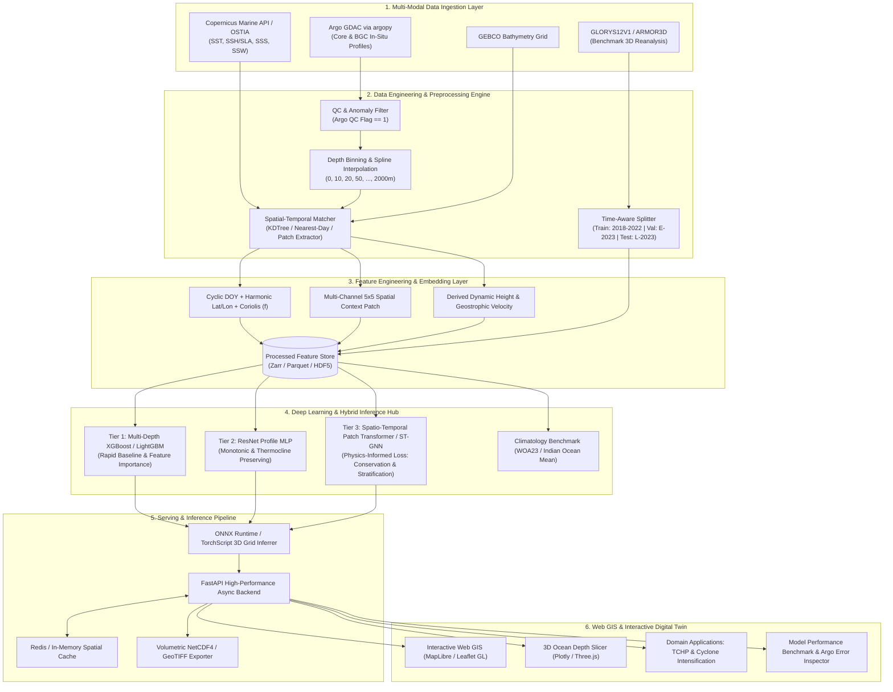

# 🌊 OceanEmbed (SIH26066)
### Satellite Embedding-Based Deep Learning Framework for Reconstruction of Subsurface Ocean Temperature from Surface Satellite Observations

[](https://www.sih.gov.in/)
[](https://www.python.org/)
[](https://pytorch.org/)
[](https://fastapi.tiangolo.com/)
[](ARCHITECTURE.md)

---

## 📌 1. Project Overview & Problem Statement

**Problem ID**: SIH26066  
**Track**: Software Track  
**Organization**: Ministry of Earth Sciences (MoES)  
**Target Region**: North Indian Ocean (Arabian Sea & Bay of Bengal: Lat `[-10°S, 25°N]`, Lon `[60°E, 90°E]`)  

### The Core Challenge
Satellites observe the ocean surface continuously at high spatial resolution (SST, Sea Level Anomaly/SSH, Salinity, Wind), but cannot peer directly into the subsurface ocean. In-situ instruments like **Argo floats** provide accurate temperature profiles down to 2000m depth, but only as sparse point measurements (~4,000 floats worldwide, reporting every 10 days). 

Because surface dynamic variables (e.g., Sea Surface Height and SST) are physically coupled to subsurface thermal structures (such as warm-core eddies, thermocline variations, and upwelling), **OceanEmbed** uses physics-aware deep learning and multi-scale spatial-temporal embeddings to learn this non-linear coupling and reconstruct a continuous, high-resolution **3D/4D volumetric ocean temperature field (0–2000m)** across space and time.

### Real-World Domain Impact
- 🌀 **Tropical Cyclone Rapid Intensification**: Predicts deep **Tropical Cyclone Heat Potential (TCHP)** and $26^\circ\text{C}$ Isotherm Depth ($D_{26}$) to forecast storm intensification.
- 🌧️ **Monsoon & Climate Dynamics**: Enhances Indian Ocean Dipole (IOD) and air-sea heat flux modeling.
- 🐟 **Marine Resources & Fisheries**: Identifies thermocline boundaries and upwelling zones.
- 🛡️ **Defense & Acoustic Modeling**: High-precision sound velocity profiles (SVP) for submarine and sonar operations.

---

## 📐 2. System Architecture



---

## 🔬 3. Key Pipeline Stages

### 3.1. Data Ingestion & Quality Control
- **Copernicus Marine API (`copernicusmarine`)**: Ingests L4 daily OSTIA Sea Surface Temperature ($0.05^\circ$), Altimetry Sea Level Anomaly ($0.25^\circ$), Multi-mission SSS ($0.125^\circ$), and Blended Sea Surface Wind ($0.125^\circ$).
- **Argo Floats (`argopy`)**: Queries Global Data Assembly Centre (GDAC) profiles. Applies strict **QC Flag = 1** filtering to discard faulty sensor profiles.
- **PCHIP Interpolation**: Standardizes irregular float measurements into 36 standard depth levels: `[0, 5, 10, 20, 30, 50, 75, 100, 125, 150, 200, 250, 300, 400, 500, 600, 700, 800, 900, 1000, 1200, 1400, 1600, 1800, 2000m]`.
- **Temporal Splitting**: 
  - **Train**: 2018–2022 (5-year climate cycle coverage)
  - **Validation**: Jan–Jun 2023
  - **Test**: Jul–Dec 2023 (*Strict time splitting avoids spatial-temporal data leakage*).

### 3.2. Feature Engineering & Embedding Extraction
- **Temporal & Positional**: Cyclic day-of-year encoding ($\sin, \cos$), Coriolis parameter $f = 2\Omega\sin(\text{lat})$, harmonic coordinates.
- **Spatial Patch Context**: Extracts $5 \times 5$ spatial neighborhood grids around target points to capture mesoscale eddies and thermal front dynamics.
- **Ocean Dynamics**: Dynamic height anomalies and wind stress curl $\nabla \times \vec{\tau}$.

### 3.3. Multi-Tier Model Progression
1. **Tier 1 (Day 1–2 Baseline)**: Multi-depth Gradient Boosted Trees (**XGBoost / LightGBM**) for rapid verification and SHAP feature importance analysis.
2. **Tier 2 (Day 3–4 Core Deliverable)**: Deep **ResNet Profile MLP** predicting the continuous 36-depth temperature profile $T(z)$ simultaneously.
3. **Tier 3 (Day 5+ SOTA)**: **Spatio-Temporal Patch Transformer / GNN** with **Physics-Informed Loss Function**:
   $$\mathcal{L}_{\text{total}} = \mathcal{L}_{\text{MSE}}(T_{\text{pred}}, T_{\text{true}}) + \lambda_1 \mathcal{L}_{\text{stratification}} + \lambda_2 \mathcal{L}_{\text{smoothness}}$$
   - $\mathcal{L}_{\text{stratification}} = \frac{1}{N}\sum \max\left(0, \frac{\partial T_{\text{pred}}}{\partial z} - \epsilon\right)$ (penalizes unphysical non-inversion temperature increases with depth).
   - $\mathcal{L}_{\text{smoothness}} = \left\|\frac{\partial^2 T_{\text{pred}}}{\partial z^2}\right\|_2$ (preserves vertical thermocline gradient continuity).

---

## 📊 4. Evaluation Protocol

| Metric | Purpose | Target Benchmark |
|---|---|---|
| **Depth-Stratified RMSE & MAE** | Verifies accuracy across Epipelagic ($0\text{--}200\text{m}$), Mesopelagic ($200\text{--}1000\text{m}$), and Bathypelagic ($1000\text{--}2000\text{m}$) zones | $\text{RMSE} \le 0.3 - 0.6^\circ\text{C}$ (Surface) down to $\le 0.2^\circ\text{C}$ (Deep) |
| **Pearson Correlation ($R$)** | Evaluates vertical profile shape agreement | $R \ge 0.92 - 0.98$ |
| **Climatology Skill Score** | Proves the AI learns real physics beyond static historical monthly means ($\text{SS} = 1 - \frac{\text{MSE}_{\text{model}}}{\text{MSE}_{\text{climatology}}}$) | $\text{Skill Score} > 0.40$ |
| **Out-of-Sample Argo Residuals** | Validates against unseen 2023 float tracks across the Arabian Sea & Bay of Bengal | Spatial error mapped on interactive GIS |

---

## 🖥️ 5. Interactive Web GIS & 3D Digital Twin

- 🗺️ **Multi-Layer Satellite Map**: Real-time layer switcher (SST, Sea Level Anomaly, Wind vectors) with synchronized subsurface thermal maps.
- 🎚️ **Continuous Depth Slider**: Seamless slider navigating reconstructed temperatures from $0\text{m}$ to $2000\text{m}$.
- 📈 **Interactive Vertical Profile Inspector**: Click any map coordinate to generate live $T(z)$ curves with annotated **Mixed Layer Depth (MLD)** and **$26^\circ\text{C}$ Isotherm Depth ($D_{26}$)** against Climatology and nearby Argo floats.
- 🧊 **3D Volumetric Ocean Slicer**: 3D thermocline isosurface rendering powered by Plotly & Three.js.
- 🌪️ **Cyclone Intelligence / TCHP Engine**: Dynamic computation of Ocean Heat Content:
  $$\text{TCHP} = \rho c_p \int_{0}^{D_{26}} (T(z) - 26) \, dz$$

---

## 📂 6. Repository Structure

```
ordinary/
├── ARCHITECTURE.md               # Complete System Architecture & Detailed Technical Specs
├── SIH26066_OceanEmbed_Working_Guide.md # Domain Handbook & Hackathon Guide
├── README.md                     # Project Overview & Quickstart (this file)
├── requirements.txt              # Python Dependencies
├── package.json                  # Workspace Meta & NPM Scripts
│
├── config/                       # Data & Model Configuration Files
│   ├── data_config.yaml          # Bounding box, variables, date ranges, CMEMS auth
│   └── model_config.yaml         # Hyperparameters for Tier 1, Tier 2, Tier 3 models
│
├── data/                         # Data Storage (Git-ignored)
│   ├── raw/                      # Raw NetCDF downloads from Copernicus & Argo
│   ├── processed/                # QC-filtered, PCHIP-regridded NetCDF & Zarr arrays
│   └── embeddings/               # Precomputed spatial patch tensors
│
├── src/                          # Core Python Engine
│   ├── data/                     # Ingestion (Copernicus/Argo), QC, PCHIP interpolators
│   ├── features/                 # Spatial 5x5 patch extractors & ocean derivatives
│   ├── models/                   # Tier 1 (XGBoost), Tier 2 (ResNet MLP), Tier 3 (Transformer)
│   ├── evaluation/               # Depth-wise RMSE, MAE, Skill Score & Argo evaluators
│   ├── domain/                   # MLD & Tropical Cyclone Heat Potential (TCHP) calculators
│   └── api/                      # FastAPI async REST server & NetCDF volumetric exporter
│
├── web/                          # Frontend Application (Digital Twin Dashboard)
│   ├── index.html                # Main application interface
│   ├── src/                      # MapLibre/Leaflet GIS, 3D volumetric slices, profile charts
│   └── public/                   # Static icons & sample data previews
│
├── notebooks/                    # Jupyter Notebooks for EDA & Model Experiments
│   ├── 01_eda_satellite_argo.ipynb
│   ├── 02_tier1_xgboost_experiments.ipynb
│   ├── 03_tier2_mlp_training.ipynb
│   └── 04_reconstruction_and_tchp_demo.ipynb
│
└── tests/                        # Automated Unit & Integration Tests
    ├── test_data_pipeline.py
    ├── test_models.py
    └── test_api.py
```

---

## 👥 7. Team Role Allocation

| Role | Focus Area & Responsibilities |
|---|---|
| **Data Engineer (1 person)** | Copernicus Marine API, `argopy` GDAC pipeline, QC flag filtering, PCHIP depth binning, Zarr feature store. |
| **ML/DL Engineers (1–2 people)** | Tier 1 (XGBoost) baseline $\rightarrow$ Tier 2 (ResNet Profile MLP) $\rightarrow$ Tier 3 (Transformer/GNN) with physics-informed loss. |
| **Frontend / Web GIS Developer (1 person)** | Interactive Leaflet/MapLibre map, depth slider, vertical profile chart, 3D isosurface viewer, dark glassmorphic UI. |
| **Domain Lead & Presenter (1 person)** | Physical oceanography validation, cyclone TCHP use-case framing, slide deck, jury presentation. |

---

## 🚀 8. Quickstart & Setup

### Prerequisites
- Python 3.10 or higher
- Node.js 18+ (for Web UI development)
- Free account on [Copernicus Marine Service](https://marine.copernicus.eu/)

### Installation

```bash
# 1. Clone repository & navigate to folder
git clone https://github.com/cyber-atharv/ordinary.git
cd ordinary

# 2. Set up Python virtual environment
python -m venv venv
venv\Scripts\activate     # On Windows (or 'source venv/bin/activate' on Linux/macOS)

# 3. Install core dependencies
pip install -r requirements.txt
```

### Running the API & Frontend

```bash
# Start the FastAPI inference backend
uvicorn src.api.main:app --reload --port 8000

# Open the Web GIS Dashboard
# Open web/index.html in browser or serve via Vite/Live Server
```

---

## 📖 9. Documentation References

- 📐 [**ARCHITECTURE.md**](ARCHITECTURE.md) — Comprehensive technical architecture, equation formulations, and data structures.
- 📘 [**SIH26066 Working Guide**](SIH26066_OceanEmbed_Working_Guide.md) — Practical guide to ocean data sources, QC flags, and hackathon execution strategies.
