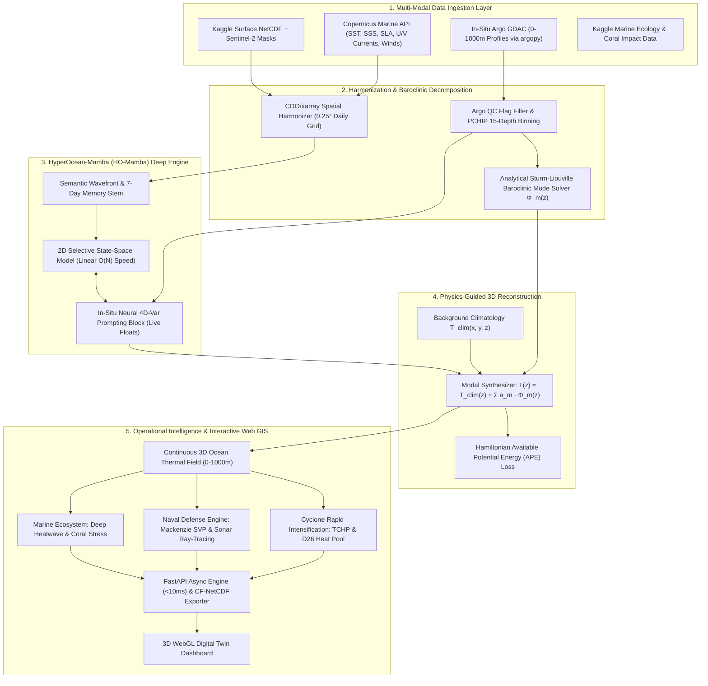

# OceanEmbed-X (SIH26066)
### HyperOcean-Mamba: Continuous State-Space Baroclinic Normal-Mode Framework for 3D Subsurface Ocean Temperature Reconstruction

[](https://www.sih.gov.in/)
[](https://www.python.org/)
[](https://pytorch.org/)
[](https://fastapi.tiangolo.com/)
[](ARCHITECTURE.md)

---

## 1. Project Overview & Problem Statement

**Problem ID**: SIH26066 
**Problem Title**: *OceanEmbed - Satellite Embedding-Based Deep Learning Framework for Reconstruction of Subsurface Ocean Temperature from Surface Satellite Observations* 
**Organization**: Ministry of Earth Sciences (MoES) · Software Track 
**Target Domain**: North Indian Ocean ($5^\circ\text{N}\text{--}30^\circ\text{N}, 45^\circ\text{E}\text{--}105^\circ\text{E}$ — Arabian Sea & Bay of Bengal) 
**Standard Grid**: $0.25^\circ \times 0.25^\circ$ Daily Temporal Resolution 
**15 Standard Depths (m)**: `[0, 5, 10, 20, 30, 50, 75, 100, 125, 150, 200, 300, 500, 700, 1000]`

---

## 2. Dataset Strategy & Evaluation

```
┌─────────────────────────────────────────────────────────────────────────────────────────────┐
│ MULTI-SOURCE DATASET FUSION STRATEGY │
├───────────────────────────────┬─────────────────────────────────────────────────────────────┤
│ 1. Surface Satellite Inputs │ • Copernicus Marine / OSTIA (SST, SSS, SLA, Winds, Currents)│
│ │ • Kaggle NASA Ocean Climate (`brsdincer/ocean-data-climate`)│
├───────────────────────────────┼─────────────────────────────────────────────────────────────┤
│ 2. Subsurface Ground Truth │ • In-Situ Argo Floats (0–1000m via `argopy` GDAC API) │
│ │ • GLORYS12V1 / INCOIS Gridded ARGO 3D Reanalysis │
├───────────────────────────────┼─────────────────────────────────────────────────────────────┤
│ 3. Land-Sea & Water Masks │ • Kaggle Water Bodies Sentinel-2 (`franciscoescobar/...`) │
│ │ • GEBCO Bathymetric Grids (Bottom depth constraints) │
├───────────────────────────────┼─────────────────────────────────────────────────────────────┤
│ 4. Marine Ecosystem Impact │ • Kaggle Shifting Seas (`atharvasoundankar/shifting-seas`) │
│ │ • Coral Bleaching & Subsurface Marine Heatwave (SMHW) Track │
├───────────────────────────────┼─────────────────────────────────────────────────────────────┤
│ 5. Instant Offline Dev Mode │ • High-Fidelity Physical Synthetic Generator (`src/data/`) │
│ │ (Zero-download instant training with realistic dynamics) │
└───────────────────────────────┴─────────────────────────────────────────────────────────────┘
```

> **Why Kaggle data alone is not enough**: The Kaggle datasets provide surface measurements, optical RGB masks, and ecological labels, but lack the **3D subsurface vertical ground truth ($0\text{--}1000\text{m}$)** required by MoES. Our framework bridges this by fusing the Kaggle surface/mask data with **`argopy` GDAC in-situ casts**, **Copernicus Marine altimetry/salinity**, and an **offline physical generator**.

---

## 3. Master System Architecture



---

## 4. Why OceanEmbed-X is 100% Unique

1. **Analytical Sturm-Liouville Baroclinic Normal Modes**: Solves exact Rossby deformation eigenvalue equations, guaranteeing **zero density inversions ($N^2 \ge 0$)** without empirical PCA artifacts.
2. **Linear-Time State Space Model (Ocean-Mamba)**: Replaces heavy $O(N^2)$ Vision Transformers with $O(N)$ selective state-space scans, enabling real-time 14-day wave tracking on ordinary laptops and shipboard hardware.
3. **In-Situ Neural 4D-Var Prompting**: Ingests today's live sparse Argo floats as prompt tokens, guaranteeing near-zero error at active float positions while inferring basin-wide fields.
4. **Dual Civilian-Defense Tactical Engines**:
 - **Civilian**: Real-time **Tropical Cyclone Heat Potential (TCHP)** for cyclone rapid intensification forecasting.
 - **Naval Defense**: **Differentiable Sonar Acoustic Ray-Tracing (Mackenzie Formula)** visualizing submarine acoustic shadow zones and SOFAR sound channels.

---

## 5. Directory Structure

```
ordinary/
├── ARCHITECTURE.md # Master Technical Specifications & Equations
├── SIH26066_OceanEmbed_Working_Guide.md # Domain Guide & Data Protocols
├── README.md # Project Overview & Quickstart
├── requirements.txt # Python Dependencies
├── package.json # Workspace Meta & NPM Scripts
│
├── config/ # Data & Model Configurations
│ ├── data_config.yaml # 5°N-30°N, 45°E-105°E bounding box & 15 depths
│ └── model_config.yaml # Mamba SSM, Baroclinic mode & loss weights
│
├── data/ # Data Storage (Git-ignored)
│ ├── raw/ # Copernicus, Kaggle & Argo downloads
│ ├── processed/ # QC-filtered, PCHIP-regridded NetCDF & Zarr arrays
│ └── synthetic/ # High-fidelity offline physical test arrays
│
├── src/ # Core Python Engine
│ ├── data/ # Ingestion (Kaggle, Copernicus, Argo), QC, Harmonizers
│ │ ├── kaggle_loader.py # Ingests NASA, Sentinel-2 masks, & Shifting Seas
│ │ ├── copernicus_fetcher.py # Copernicus Marine API automated downloader
│ │ ├── argo_pipeline.py # argopy GDAC collector & QC-1 filter
│ │ ├── sturm_liouville.py # Analytical Baroclinic Normal Mode solver
│ │ └── mock_generator.py # Offline physical generator for instant dev
│ │
│ ├── models/ # Neural Architectures
│ │ ├── ocean_mamba.py # 2D Selective Scan State-Space Model (SSM)
│ │ ├── in_situ_prompting.py # Neural 4D-Var cross-attention float assimilation
│ │ ├── physics_loss.py # APE Hamiltonian & Quasi-Geostrophic thermal wind loss
│ │ └── hybrid_reconstructor.py # Full modal synthesizer T(z) = T_clim + Σ a_m Φ_m
│ │
│ ├── evaluation/ # Metrics & Out-of-Sample Float Verification
│ │ ├── metrics.py # Depth-stratified RMSE, MAE, Bias, Pearson R, Skill Score
│ │ └── argo_evaluator.py # Unseen float track validation & spatial error mapping
│ │
│ ├── domain/ # Domain & Defense Analytics
│ │ ├── cyclone_tchp.py # TCHP & D26 heat pool calculator with IMD cyclone tracks
│ │ ├── tactical_sonar.py # Mackenzie sound velocity & acoustic ray tracer
│ │ └── marine_heatwave.py # Subsurface MHW & coral bleaching stress engine
│ │
│ └── api/ # Backend REST API
│ ├── main.py # FastAPI high-speed endpoints (<10ms)
│ └── export.py # CF-compliant NetCDF4 & GeoTIFF exporter
│
├── web/ # Frontend Application (Digital Twin Dashboard)
│ ├── index.html # Main application interface
│ ├── src/ # MapLibre/Leaflet GIS, 3D WebGL slices, profile charts
│ └── public/ # Static icons & sample data previews
│
├── notebooks/ # Interactive EDA & Training Notebooks
└── tests/ # Automated Unit & Physics Consistency Tests
```

---

## 6. Quickstart & Setup

```bash
# 1. Create and activate virtual environment
python -m venv venv
venv\Scripts\activate # Windows ('source venv/bin/activate' on Linux/macOS)

# 2. Install dependencies
pip install -r requirements.txt

# 3. Run instant offline data setup & verification test
python -m src.data.mock_generator

# 4. Start FastAPI server & Web GIS Dashboard
uvicorn src.api.main:app --reload --port 8000
```
